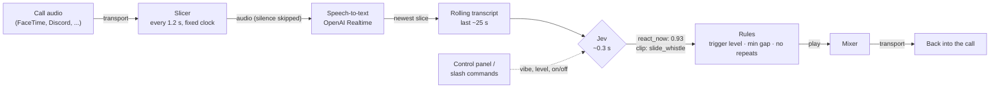

# Jev Soundboard

**An AI sidekick that listens to your call and fires the perfect soundboard clip in about a
second, even when everyone's talking over each other.** Powered by
[Jev](https://docs.typesafe.ai), TypeSafe's fast decision model.

Someone brags and fails in the same breath: *sad trombone*. A terrible pun: *ba-dum-tss*. A big
reveal: *drumroll*. Nobody presses a button. It works on FaceTime, Discord, Zoom, a stream, or
anything else with a microphone setting, and it comes with 15 synthesized sounds, so it works
before you've added a single clip.

> **Demo (what you'd see):** three friends on a FaceTime call, all talking at once about a game.
> One of them says "watch this, I'm literally the best driver ever", then drives straight off a
> cliff. About a second later, everyone hears a falling slide whistle. Nobody touched anything.
> The control panel on a phone shows `⚡ slide_whistle (0.31s, react 0.93) ← "and he drove it
> straight off the cliff"`.

## Quickstart

You need [uv](https://docs.astral.sh/uv/), ffmpeg (`brew install ffmpeg`), a
[TypeSafe API key](https://typesafe.ai) for Jev, and an OpenAI key for speech-to-text.

```sh
git clone https://github.com/<you>/jev-soundboard && cd jev-soundboard
uv sync
cp .env.example .env            # add TYPESAFE_API_KEY and OPENAI_API_KEY
uv run jevboard effects --play all                      # hear the built-in sounds
uv run jevboard try "he said he'd win and then fell off the map"   # see what Jev picks
```

### FaceTime (or Zoom, Meet, Discord desktop...)

```sh
brew install blackhole-2ch blackhole-16ch       # free loopback audio devices
cp jevboard.example.toml jevboard.toml          # set listen/output/mic devices
uv run jevboard doctor                          # checks keys, devices, routing
uv run jevboard                                 # go: open the control panel URL it prints
```

The 5-minute audio routing recipe (one Multi-Output Device, two menu settings) is in
**[docs/AUDIO-SETUP.md](docs/AUDIO-SETUP.md)**.

### Discord

A real bot: `/soundboard join` in a voice channel, and it plays clips straight into it.

```sh
uv sync --extra discord && brew install opus
# create a bot, put DISCORD_BOT_TOKEN in .env, invite it: see docs/DISCORD.md
uv run jevboard discord
```

Then type `/soundboard join`, `/soundboard vibe only hype people up`,
`/soundboard level trigger-happy`, `/soundboard play airhorn`. **Heads-up:** Discord's new
end-to-end voice encryption (DAVE) means bots can't reliably *hear* a channel yet in any library,
so for now the bot plays, and the computer running it listens through its own Discord app.
Details and the current state of things are in **[docs/DISCORD.md](docs/DISCORD.md)**.

## How it works



1. **A fixed clock, not pauses.** With a few people talking over each other there are no clean
   sentence endings, so voice-activity detection waits forever. Instead the call audio streams
   to a transcription session that's committed every **1.2 s** whatever is happening, so text
   keeps flowing once a second. Quiet slices are dropped before they're transcribed (and cost
   nothing).
2. **Only the newest slice is judged.** While Jev is answering, new slices pile into the
   transcript; when it returns, the sidekick judges the *latest* moment once and skips the stale
   ones in between. Reactions stay 1–2 s behind the conversation, never minutes.
3. **One Jev call per slice, two questions in parallel:**
   - `react_now` (a [noul](https://docs.typesafe.ai/primitives/noul)): the probability that a
     sound right now, for the newest line, makes the moment funnier. It follows the **vibe**.
   - `clip` (a [choice](https://docs.typesafe.ai/primitives/choice)): which sound fits best,
     matched against each clip's **"when to use it"** description, or "none".
4. **Code owns the rules:** fire only if `react_now` clears the **trigger level**, at least
   **4 s** have passed since the last clip, nothing is still playing, and the clip isn't among the
   last 25 played (capped at half the board, so small boards never run dry).

**Jev makes every decision. Speech-to-text is the only piece that isn't Jev** (Jev reads text,
not audio). It's isolated in [`jevboard/transcribe.py`](jevboard/transcribe.py), and OpenAI's
Realtime transcription is the default. Add another engine by registering a class in
`TRANSCRIBERS`.

### Transports

The core (Jev's decision loop, the clip index, the panel, the cost meter) doesn't know where the
audio comes from. A [transport](jevboard/transports/__init__.py) is a small class: audio in as
PCM frames, clip audio out.

| Transport | For | Audio in | Audio out |
| --- | --- | --- | --- |
| `local` | FaceTime, Discord desktop, Zoom, streams, anything | a loopback device | a loopback device the app uses as its mic |
| `discord` | Discord servers | the host's Discord app (`local`) or native receive (experimental) | straight into the voice channel |
| `fake` | tests, `jevboard try` | whatever you feed it | recorded in memory |

## The sounds

Built in, synthesized with numpy (no files, no licensing worries): `buzzer`, `airhorn`,
`sad_trombone`, `rimshot`, `drumroll`, `ding`, `bleep`, `boing`, `slide_whistle`, `tada`,
`crickets`, `boom`, `level_up`, `bonk`, `record_scratch`.

**Bring your own clips:** put them in `clips/` and describe each one in `clips/index.json`:

```json
{ "bruh": { "file": "bruh.mp3", "desc": "a friend says something cringe or painfully obvious" } }
```

or let the tool cut, normalise, swear-screen and index them for you:

```sh
uv run jevboard clips add ~/Downloads/applause.wav --start 0.3 --end 2.8 \
  --name applause --desc "someone nails an idea or wins an argument fair and square"
```

**[docs/BUILD-YOUR-CLIP-LIBRARY.md](docs/BUILD-YOUR-CLIP-LIBRARY.md)** is the full method for
building a great library (finding, trimming, screening and, most of all, *describing* clips),
with copy-paste prompts for an AI assistant at every step.

> Only use clips you have the right to use. A private call between friends is not the same as a
> public stream. This repo ships no third-party audio, and `clips/` is git-ignored.

## Tuning

Live, from the control panel (`http://localhost:8787/?t=...`, printed at startup) or Discord
slash commands:

| Knob | What it does |
| --- | --- |
| **On / off** | Stops judging entirely (no cost while off). |
| **Trigger level** | `chill` (needs 88% confidence), `normal` (75%), `trigger-happy` (60%). |
| **Vibe** | Free text Jev follows: "only hype people up, no roasting", "roast the losses gently", "react to puns only". |
| **Manual buttons** | Fire any clip yourself. |
| **Mute** | Silences clips (never your mic). |

In `jevboard.toml` or `JEVBOARD_*` env vars (see [jevboard.example.toml](jevboard.example.toml)):
`context` (what the call is, e.g. "family game night over video chat"),
`min_gap`, `recent`, `slice_seconds`, `window_seconds`, `silence_rms`, `timeout`, and the devices.

The biggest lever is your **clip descriptions**: when a clip fires at the wrong moments, rewrite its
`desc`. Watch the panel log, which shows every reaction and the line that triggered it.

## Cost per hour

Two meters, both shown live in the panel:

| Piece | Price | Per hour of non-stop talking |
| --- | --- | --- |
| **Jev** decisions | $0.042 per million input tokens (output is free) | ~3,000 decisions × ~800 tokens (built-ins) ≈ **$0.10**; with 60 clips (~1,800 tokens) ≈ **$0.23** |
| **Speech-to-text** (`gpt-4o-mini-transcribe`) | $0.003 per minute of speech | **$0.18** |

So expect **about $0.30–0.40 per hour of constant chatter**, and less in practice: silence is
skipped, and a decision only happens when new speech arrives. Prices are as of October 2026: check
[TypeSafe](https://docs.typesafe.ai/models) and OpenAI, and set `jev_price_per_mtok` and
`transcribe_price_per_minute` if they change. The Discord bot in `discord_listen = "off"` mode
costs nothing to run.

## Commands

```text
jevboard                  start (local transport)
jevboard discord          start the Discord bot
jevboard doctor [--live]  check keys, tools, devices and routing (--discord for the bot setup)
jevboard devices          list audio devices
jevboard try "line" ...   text in, Jev's picks out: tune descriptions without a call
jevboard effects          list built-in sounds (--play NAME|all, --export DIR)
jevboard clips add|screen|list
```

## Privacy

- **No recording.** Audio is streamed to speech-to-text and never written to disk.
- **Transcripts stay in memory,** in a rolling ~25 s window, and are cleared when you switch it off
  or the bot leaves. Nothing is logged to files.
- Transcript text goes to Jev (TypeSafe), and audio goes to OpenAI for transcription.
- Keys live only in your environment or `.env` (git-ignored). The control panel is protected by a
  random token in `state/panel-token`, and binds to localhost unless you change `panel_host`.
- Tell people it's there. The Discord bot announces itself every time it joins.

## Development

```sh
uv sync --extra discord
uv run pytest
```

The tests cover the transport-agnostic core (decision parsing, trigger rules, the newest-slice
logic, anti-repeat, the cost meter, index loading, the panel, audio mixing) with a fake Jev and a
fake transport, plus offline checks of the Discord bot's commands. No network or keys needed.

## License

[MIT](LICENSE). The built-in sounds are generated by the code in
[`jevboard/effects.py`](jevboard/effects.py) and are covered by the same license.
